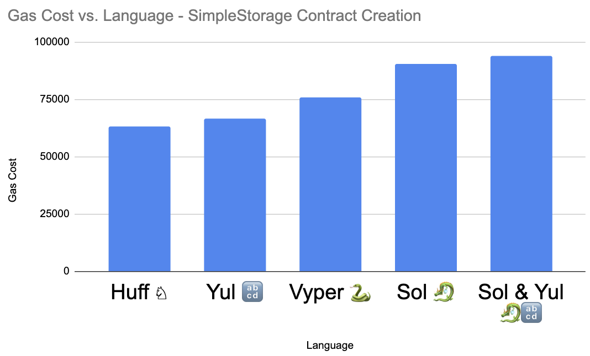

# Language Gas Comparisons

The purpose of this repo is to compare the following languages for performance (gas optimization):

- [Solidity](https://docs.soliditylang.org/en/v0.8.15/)
- [Solidity & in-line Yul](https://docs.soliditylang.org/en/v0.8.15/yul.html?highlight=yul)
- [Vyper](https://vyper.readthedocs.io/en/stable/index.html)
- [Huff](https://huff.sh/)

We also have some raw yul examples, but it's not the focus of this repo.

# Initial Results

<br/>
<p align="center">


</p>
<br/>


|    Language    |   Contract    | Gas Cost Creation | Gas Cost Store & Read Number |
|:--------------:|:-------------:|:-----------------:|------------------------------|
|     Huff ♘     | SimpleStorage |       63240       | 28099                        |
|     Yul 🔡     | SimpleStorage |       66578       | No - Data                    |
|    Vyper 🐍    | SimpleStorage |       75722       | 28057                        |
|     Sol 🐉     | SimpleStorage |       90551       | 28152                        |
| Sol & Yul 🐉🔡 | SimpleStorage |       93987       | 28204                        |


# Table Of Contents

- [Language Gas Comparisons](#language-gas-comparisons)
- [Initial Results](#initial-results)
- [Table Of Contents](#table-of-contents)
- [Working with this repo](#working-with-this-repo)
  - [Requirements](#requirements)
  - [Getting Started](#getting-started)
- [Contract Creation Gas Costs](#contract-creation-gas-costs)
  - [Requirements](#requirements-1)
  - [Getting contract creation gas](#getting-contract-creation-gas)

# Working with this repo

## Requirements

-   [Git](https://git-scm.com/book/en/v2/Getting-Started-Installing-Git)  
    -   You'll know you've done it right if you can run `git --version`
-   [Foundry / Foundryup](https://github.com/gakonst/foundry)
    -   This will install `forge`, `cast`, and `anvil`
    -   You can test you've installed them right by running `forge --version` and get an output like: `forge 0.2.0 (f016135 2022-07-04T00:15:02.930499Z)`
    -   To get the latest of each, just run `foundryup`
-   [Huff Compiler](https://docs.huff.sh/get-started/installing/)
    -   You'll know you've done it right if you can run `huffc --version` and get an output like: `huffc 0.2.0`
-   [Vyper Compiler](https://vyper.readthedocs.io/en/stable/installing-vyper.html)
    -   You'll know you've done it right if you can run `vyper --version` and get an output like: `0.3.4+commit.f31f0ec`
-   [Solidity Compiler](https://docs.soliditylang.org/en/latest/installing-solidity.html)
    -   You'll know you've done it right if you can run `solc --verison` and get an output like:
    -   `solc, the solidity compiler commandline interface Version: 0.8.15+commit.e14f2714.Darwin.appleclan`


## Getting Started

1. Clone the repo & install dependencies

```
git clone https://github.com/PatrickAlphaC/sc-language-comparison
cd sc-language-comparison
make
```

2. Run tests

```
forge snapshot
```

You'll see the gas outputs in `.gas-snapshot`. This is a good outlook on gas costs on function calls, but not on contract creation. 

# Contract Creation Gas Costs

To test how much gas it costs to deploy a contract, we need to compile the contracts, get their bytecode, and deploy it in a raw transaction. 

## Requirements

- [Python](https://www.python.org/downloads/)
    -   You'll know you've done it right if you can run `python --verison` or `python3 --version` and get an output like: 
    -   `Python 3.9.5`
- [web3py](https://web3py.readthedocs.io/en/stable/)

Setup a new venv:
```
python3 -m venv venv
source venv/bin/active
```

Then install
```
pip install -r requirements.txt
```
Rememebr to deactivate after done:

```
deactivate
```

## Getting contract creation gas

1. Compile contracts

To get the raw bytecode of each contract:

```
vyper src/vyper/VSimpleStorage.vy > bytecodes/vy/VSimpleStorage
huffc src/huff/HSimpleStorage.huff -b > bytecodes/huff/HSimpleStorage
solc --strict-assembly --optimize --optimize-runs 20000 yul/YYSimpleStorage.yul --bin | grep 60 > bytecodes/yul/YYSimpleStorage 
solc --optimize --optimize-runs 20000 src/yulsol/YSimpleStorage.sol --bin | grep 60 > bytecodes/sol/YSimpleStorage 
solc --optimize --optimize-runs 20000 src/solidity/SSimpleStorage.sol --bin | grep 60 > bytecodes/yul/SSimpleStorage 
```

2. Start local node

```
make anvil
```

3. Run script

```
python compare_contract_creation.py
```

And you'll get an output like so:

```
63240 gas for Language.HUFF
75722 gas for Language.VY
90551 gas for Language.SOL
93987 gas for Language.YUL
66578 gas for Language.YYL
```